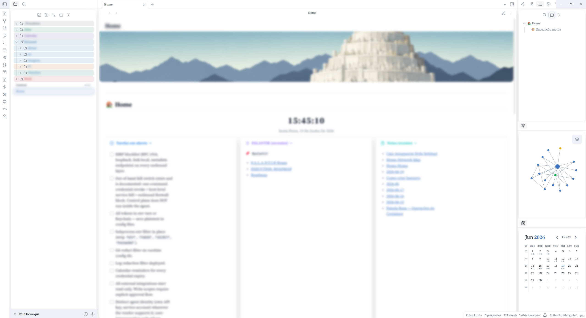

# Mirage Glass

A glassmorphism theme for [Obsidian](https://obsidian.md) with a soft frosted-glass aesthetic, blue accent glow, and colorful sidebar folders.

---

## Features

- **Glassmorphism surfaces** — sidebars, callouts, and modals with `backdrop-filter: blur()` and layered shadows
- **Three color palettes** — Mirage Dawn (light), Navy Mirage (dark), Royal Charcoal (dark alt), switchable via Style Settings
- **Blue accent glow** — focus rings, active states, and CTAs with a soft blue halo
- **Source Serif 4** — loaded from Google Fonts for an editorial reading experience
- **Folder icons** — open/closed folder icons via CSS mask, compatible with Iconize custom icons
- **Rainbow Folders** — colorful sidebar folders, two methods available (see below)
- **Style Settings support** — blur intensity, card radius, glow strength all tunable without editing CSS

---

## Screenshots



*Mirage Dawn — light mode with colorful sidebar folders, glassmorphism cards, and Source Serif 4 typography.*

---

## Installation

### Manual
1. Download the latest release
2. Copy the `MirageGlass/` folder to your vault's `.obsidian/themes/` directory
3. Open Obsidian → Settings → Appearance → Themes → select **Mirage Glass**

### From Obsidian Community Themes
> _Not yet submitted — install manually for now_

---

## Optional Snippets

Snippets go in `.obsidian/snippets/`. Enable them under Settings → Appearance → CSS Snippets.

### Rainbow Folders (recommended)

**`snippets/mg-rainbow-folders.css`** — colors the sidebar folders by position using CSS `nth-child`. No plugins required.

1. Copy `snippets/mg-rainbow-folders.css` to `.obsidian/snippets/`
2. Enable the snippet in Obsidian
3. Open Style Settings → **Mirage Glass — Rainbow Folders**
4. Toggle **Ativar Rainbow Folders** on
5. Optionally enable **Mostrar fundo colorido** for colored folder backgrounds
6. Customize each folder's color (Pasta 1–10) to match your vault structure

> Colors apply by order in the sidebar. Pasta 1 = first folder, Pasta 2 = second, and so on. The palette repeats every 10 folders.

### Sidebar Colors via Dataview (alternative)

If you prefer colors tied to specific folder **names** instead of positions, use the Dataview method. This requires the [Dataview plugin](https://github.com/blacksmithgu/obsidian-dataview).

1. Copy `snippets/mg-sidebar-colors.css` to `.obsidian/snippets/`
2. Enable the snippet
3. Add this block to the top of your `Home.md` (or any note that opens on startup):

````markdown
```dataviewjs
const c={"_Templates":"mg-_Templates","Atlas":"mg-Atlas","Calendar":"mg-Calendar","Personal":"mg-Personal","IT":"mg-IT","Obsidian":"mg-Obsidian","Work":"mg-Work"};
function a(){
  document.querySelectorAll('.nav-folder').forEach(e=>{
    const t=e.querySelector(':scope>.nav-folder-title>.nav-folder-title-content');
    if(!t)return;
    const n=t.textContent.trim();
    if(c[n]){
      Object.values(c).forEach(cls=>e.classList.remove(cls));
      e.classList.add(c[n]);
      e.querySelectorAll('.nav-folder').forEach(sub=>{
        Object.values(c).forEach(cls=>sub.classList.remove(cls));
        sub.classList.add(c[n]);
      });
    }
  });
}
a();
const s=document.querySelector('.nav-files-container');
if(s) new MutationObserver(a).observe(s,{childList:true,subtree:true});
```
````

4. Edit the folder names in the `const c={...}` object to match your vault's root folders

> This method assigns colors by name, so the colors stay correct even if you reorder folders.

---

## Style Settings

Install the [Style Settings plugin](https://github.com/mgmeyers/obsidian-style-settings) to access these controls:

| Setting | Description | Default |
|---|---|---|
| Paleta (modo escuro) | Navy Mirage or Royal Charcoal | Navy Mirage |
| Intensidade do blur | Glass blur strength (px) | 12 |
| Raio dos cards | Card corner radius (px) | 14 |
| Intensidade do glow azul | Blue glow opacity (0–1) | 0.35 |

---

## Compatibility

- Obsidian 1.4+
- Tested on 1.12.7 (Windows)
- Works with: Dataview, Iconize, Modular CSS Layout, Calendar, Style Settings
- The folder icon CSS is compatible with Iconize custom icons (uses `::before` on the parent element, not inside `.nav-folder-title-content`)

---

## Credits

- Glassmorphism inspiration from various UI design references
- Folder icon SVGs from [Lucide Icons](https://lucide.dev)
- Font: [Source Serif 4](https://fonts.google.com/specimen/Source+Serif+4) by Google Fonts
- Rainbow folders technique inspired by [AnuPpuccin](https://github.com/AnubisNekhet/AnuPpuccin) by AnubisNekhet

---

## License

MIT License — feel free to fork, modify, and share.
